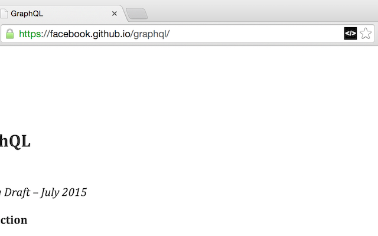

## GitHub Pages to Repo Extension

Add a "View Source on GitHub" button to the omnibar on any GitHub page (using the `github.io`) domain.

Example: `https://facebook.github.io/graphql/` -> `https://github.com/facebook/graphql/`

## Licence

[http://rmlewisuk.mit-license.org/](http://rmlewisuk.mit-license.org/)